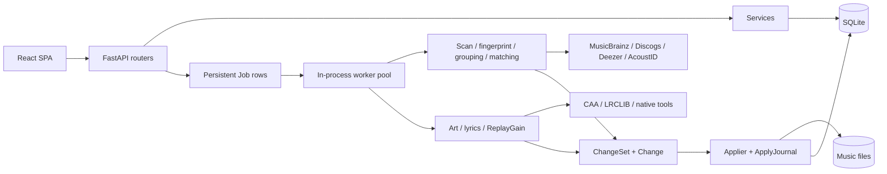

# Recovery audit

Audit eseguito il 2026-07-31 sul commit `346c919` (`main`), prima di qualunque
refactor esteso. I file già modificati o non tracciati presenti nel workspace non sono
stati alterati. La fonte primaria dei rilievi è il brief di recovery; il registro completo
con severità e stato è in [issues-matrix.md](issues-matrix.md).

## Executive summary

Muzilla non richiede una riscrittura totale. Il repository contiene un backend ben
stratificato, migrazioni lineari, operazioni file prudenti, hardening concreto e una suite
ampia. I controlli statici, 998 test Python, 97 test frontend e 44 dei 45 E2E hanno avuto
esito positivo. Questa è una base sostanziale e recuperabile.

La qualità interna, però, non coincide con la correttezza del prodotto. I difetti più
gravi sono ai confini fra sottosistemi:

1. il modello `ChangeSet` rappresenta contemporaneamente proposta, review, batch di
   operazioni, enrichment e undo; scegliere di nuovo un candidato crea nuovi draft;
2. il matching valuta search summary non idratati, mentre gli unit test valutano oggetti
   completi; per le singleton alcuni adapter non cercano nemmeno titolo e artista;
3. i job dichiarano cancellazione ma gli handler reali osservano uno stato ORM obsoleto;
4. scan, matching, rename, art, lyrics e ReplayGain sono separati tecnicamente e anche
   concettualmente nella UI, mentre l'utente ha bisogno di una sola unità di lavoro;
5. configurazione salvata, stato provider e capability di runtime non rappresentano lo
   stato effettivo. Il container è `healthy` anche quando `rsgain` non può caricarsi;
6. API e frontend duplicano i tipi; valori strutturati come lyrics arrivano a un editor
   scalare e diventano `[object Object]`;
7. l'information architecture espone dettagli tecnici (`groups`, `retention_sweep`,
   changeset) e rende secondario il journey file→proposta→review→apply.

La raccomandazione è conservare circa il **70% del codice complessivo**: circa 80–85%
di persistence, tag/file operations, auth e tooling; 65–75% degli adapter/provider e
job primitives; 40–50% del matching orchestration, lifecycle changes/review e frontend
di flusso. Il dato è una stima di pianificazione, non una metrica di linee da mantenere.

## Scope e metodo

Sono stati esaminati struttura, configurazione, cronologia recente, documentazione,
modelli, migrazioni, servizi, route, pipeline, worker, provider, componenti e test. Sono
stati seguiti in particolare i percorsi dei bug dal click/API fino a persistence,
filesystem o provider. Non sono state fatte chiamate live ai cataloghi esterni: i bug di
query sono stati verificati staticamente e tramite i contratti/test presenti, per non
trasformare un audit in traffico non deterministico o dipendente da rate limit.

Ordine di grandezza osservato:

- 165 file Python applicativi, circa 17.600 righe backend;
- circa 11.200 righe frontend, di cui circa 3.600 generate da OpenAPI;
- circa 13.800 righe di test, più 45 scenari Playwright;
- dieci migrazioni Alembic, da baseline a settings;
- immagine singola FastAPI+SPA, database SQLite in WAL e volume persistente.

## Stack e struttura attuale

### Backend

- Python 3.12, FastAPI, Pydantic, Typer;
- SQLAlchemy 2, SQLite WAL, Alembic;
- `httpx`/`hishel` per provider e cache HTTP;
- Mutagen per tag, Pillow per art, Chromaprint/AcoustID, `rsgain` nativo;
- RapidFuzz, NumPy e SciPy per matching;
- Argon2 e cookie firmati per autenticazione;
- worker async in-process con job persistiti, lease ed eventi/SSE.

Il package `src/muzilla` segue la stratificazione verificata anche da import-linter:

```text
domain / config
       ↓
db, tags, paths, audio, providers, matching, changes
       ↓
pipeline, jobs, services
       ↓
api, cli
```

I principali entry point sono la CLI `muzilla`, `api.app:create_app`, il lifespan FastAPI
e il pool di worker avviato nello stesso processo. L'app esegue le migrazioni e il
recovery di job/journal prima di accettare lavoro.

### Frontend

- React 19, TypeScript 6, Vite 8;
- React Router 7;
- TanStack Query, Table e Virtual;
- Zustand per selezioni/stato locale trasversale;
- Tailwind 4 e primitive UI locali;
- Vitest/Testing Library; Playwright in `e2e`.

La SPA è compilata nel package Python e servita da FastAPI. `AppShell` contiene la
navigazione laterale; le pagine principali attuali sono Dashboard, Catalog, Groups,
Changes, Jobs, Duplicates, Import e Settings.

### Deployment

`docker/Dockerfile` compila frontend e `rsgain`, installa l'app e gira come UID 1000.
`docker-compose.yml` pubblica la porta 1846, monta `/data` e `/music`, elimina tutte le
capability, abilita `no-new-privileges`, limita CPU/memoria e ruota i log. Il database,
blob e cache stanno nel volume `muzilla-data`; la libreria musicale è un bind mount.

## Architettura e flussi correnti



### Import corrente

`ImportSession` orchestra quattro task sequenziali: scan, fingerprint, grouping e match.
Il matching crea uno o più `ChangeSet` draft. Cover, lyrics e ReplayGain non sono nodi
dello stesso import: sono job avviabili separatamente che producono propri changeset.

### Review e apply correnti

Un `ChangeSet` contiene `Change` per campo/operazione e decisioni
`pending/accepted/rejected`. Solo gli accepted sono applicati. Tag, art e lyrics sono
scritti su copia temporanea nella stessa directory, fsync e `os.replace`; move e undo
usano `ApplyJournal` e aggiornano anche `Track.path/filename`. La base file-operation è
quindi buona. Il match, però, non propone un `move`: il rename viene generato da una
pagina/API distinta.

### Provider correnti

`ProviderSet` viene costruito una volta nel lifespan dalla configurazione file/env.
Ricerca multi-provider usa `asyncio.gather(return_exceptions=True)`: un provider fallito
viene loggato e omesso, senza comunicare al contratto candidate se “nessun risultato”
significhi zero hit oppure errore. La cache persistente è separata dagli oggetti provider.
Lo status è un tracker passivo e process-local aggiornato solo dopo traffico reale.

## Modello concettuale attuale

| Concetto | Significato reale | Problema |
|---|---|---|
| `Track` | Indice persistente di un file e snapshot dei tag/probe | Buona base; le righe missing sono nascoste dal catalogo. |
| `TrackGroup` | Cluster inferito album/singleton/partial, pinning sticky | Necessario internamente, impropriamente esposto come oggetto utente. |
| `ReleaseCandidate` | Forma comune di un risultato provider | Search summary e release idratata condividono una forma che non garantisce tracklist/count. |
| `ChangeSet` | Draft/review/batch/apply/undo/enrichment | Troppe responsabilità; manca identità della review logica e revisioning. |
| `Change` | Operazione su campo/file con decisione | Solido come operation record, ma `new_value: object` non è tipizzato per op. |
| `Job` / `JobEvent` | Esecuzione tecnica persistita e log | Buona primitive; cancellazione/cooperative progress incompleti. |
| `ImportSession` / `Task` | Orchestrazione macro-stadi import | Riutilizzabile, ma non aggrega enrichment/review né stato per elemento. |
| `ApplyJournal` | Recovery/undo delle scritture | Componente affidabile da preservare. |
| `Blob` | Contenuto art/backup referenziato | Refcount utile; proposta e stato corrente art sono confusi a livello gruppo. |
| `Setting` | JSON key/value incluse credenziali | Non è un configuration source effettivo per provider; token in chiaro. |

La terminologia utente “Changes/Review/Edit” non corrisponde a questa tassonomia. Non
esiste una pagina `/edits` distinta nel router attuale, mentre ChangeSet ingloba anche
manual edit e enrichment.

## Root cause confermate

### 1. Contratti incompleti fra ricerca, idratazione e ranking

`MusicBrainzProvider._candidate_from_search_hit` e gli equivalenti Discogs/Deezer
costruiscono candidati senza tracklist. `pipeline.matching._to_candidate_row` calcola il
conteggio con `len(tracks)`, e il motore assegna il punteggio prima di `get_release`.
Questa sola causa produce sia `0 tracks` sia ranking povero.

Per la singleton il problema è maggiore: `propose_track_candidates` prepara title,
artist, duration e ISRC, ma il builder Lucene MusicBrainz usa album/album_artist/barcode/
catalog number; Deezer interroga `/search/album`; Discogs cerca release. Nel repository
non esiste un parser del filename, quindi “metadata + filename” non è implementato.

I test del motore usano candidati già completi e un corpus sintetico di tredici casi;
non esercitano il contratto search-summary→hydrate. Il fallback fuzzy basato sul massimo
fra token-set e ratio, senza soglia assoluta di rifiuto, spiega risultati apparentemente
simili ma semanticamente estranei.

### 2. Lifecycle review non identificato

Le route GET dei candidati sono correttamente read-only. Il duplicato nasce quando si
sceglie un candidato: `stage_group_match`/`stage_track_match` chiamano sempre
`build_changeset`; il frontend naviga al nuovo ID e il vecchio draft resta attivo. Non
esistono active-draft uniqueness, revision, superseded state o idempotency key per questa
operazione. Fetch attempt, proposal e review sono implicitamente lo stesso oggetto.

Lo stesso sovraccarico spiega la frammentazione: `stage_art_for_group` e
`stage_lyrics_for_track` creano nuovi changeset; l'import matching ne crea altri; il
rename ne crea un altro. `default_decision_for_kind("enrichment")` accetta inoltre
automaticamente proposte considerate “non destructive”, una scelta in conflitto con la
review unica richiesta.

### 3. Cancellazione su stato ORM obsoleto

Le sessioni usano `expire_on_commit=False`. Il worker carica `Job` una volta e passa
l'istanza agli handler; la route cancel aggiorna la stessa riga da un'altra sessione.
Gli handler reali controllano `job.cancel_requested` senza `session.refresh(job)`.
Lo scan non espone neppure callback/checkpoint, mentre l'import controlla solo tra macro
stadi. Il test unitario fittizio effettua il refresh da sé e l'E2E ammette sia
`cancelled` sia `succeeded`, nascondendo il difetto.

### 4. Configurazione dichiarata ma non effettiva

`services/settings.py` persiste `providers.<name>` e avverte che servirà un restart.
Tuttavia `api.app:lifespan` chiama `build_provider_set(config)` senza mai fondere le righe
`Setting`; la configurazione DB non ha effetto nemmeno dopo il restart. Quando manca una
riga, la Settings UI assume ogni provider enabled, anziché mostrare la config effettiva.

I token sono write-only rispetto all'API, ma restano testo in chiaro nel JSON SQLite.
Questo evita leakage al browser/log, non soddisfa persistenza sicura, export e reset.

### 5. Health non rappresenta capability

Il Dockerfile installa le librerie di sviluppo necessarie a compilare `rsgain` e poi le
rimuove con `apt-get purge --auto-remove`. L'ispezione runtime ha rilevato quattro shared
library mancanti. Nello smoke Compose isolato, il container risultava `healthy` e
`/api/health` rispondeva `{"status":"ok"}`, mentre `rsgain --version` terminava 127 per
`libtag.so.2`. La readiness HTTP non verifica binari/capability né storage/cache/blob.

### 6. Tipi API duplicati

`frontend/src/lib/api-types.ts` è generato da OpenAPI, ma `frontend/src/lib/api.ts`
importa i tipi manuali da `lib/types.ts`. Lo stato `undo_expired` manca già dall'union
manuale e richiede workaround nelle pagine. `Change.new_value` rimane `unknown/object`;
la review fa `String(change.new_value)` e converte il payload lyrics in
`[object Object]`. Il problema non è il singolo input, ma l'assenza di una union per
operazione e di adapter view-model.

### 7. Shell e routing senza ownership unica dello scroll/history

`AppShell` usa un viewport fisso, diverse pagine dichiarano un altro `h-screen` o
`min-h-screen`, la sidebar non ha overflow indipendente e la toolbar review è fixed su
tutto il viewport. J/K modifica un indice senza portare l'elemento in vista. Il router
non conserva origine, filtro e scroll e la selezione candidato aggiunge una nuova entry
history. Questi sono difetti sistemici, non quattro valori CSS indipendenti.

## Altri rilievi confermati

- La ricerca catalogo passa input grezzo a FTS5 `MATCH`; caratteri ordinari come `-`
  possono generare 500. `docs/KNOWN_BUGS.md` lo documenta e un E2E verifica soltanto che
  l'errore venga mostrato, consolidando il difetto (`BUG-CATALOG-001`).
- Applicare via API un changeset con sole decisioni pending produce job succeeded,
  changeset applied e zero file modificati (`BUG-APPLY-001`).
- `stage_art_for_group` assegna `group.art_blob_id` già allo staging, prima dell'apply:
  una proposta diventa impropriamente stato corrente (`DOMAIN-ART-001`).
- Dashboard offre solo aggregati. Il catalogo filtra `missing_since IS NULL`, quindi non
  può essere destinazione del drill-down missing.
- Il detector duplicates principale raggruppa MB recording ID ricavati da AcoustID;
  `services/analyze.py` ha anche un criterio euristico artista/titolo. L'utente vede due
  concetti potenzialmente diversi con spiegazione insufficiente.
- `retention_sweep` è manutenzione interna: scadenza undo journal/blob e provider cache.
  La sua presenza nella lista Jobs espone implementazione anziché outcome.
- L'idempotency apply/undo è una cache in-process e si perde al restart. È accettabile
  solo finché ApplyJournal e state machine impediscono doppi side effect; il nuovo
  lifecycle deve rendere l'idempotenza persistente per le mutazioni core.

## Ipotesi da verificare nelle slice

Questi punti non vengono dichiarati bug risolti o definitivamente diagnosticati:

- il move aggiorna `Track.path` e `filename` ed è coperto da unit/integration test, quindi
  non ci sono prove che causi il missing osservato; serve un test apply-move→rescan reale;
- le query Deezer sono strutturalmente inadatte alle singleton, ma la qualità live per
  l'esempio “Where Legends Rise…” va misurata con contract fixture registrata e non con
  aspettative su un provider mutevole;
- la stima di conservabilità deve essere ricalibrata dopo la prima migrazione
  ReviewBundle; non è un commitment di effort;
- non è ancora dimostrato che serva un database diverso da SQLite. Il workload resta
  single-user e le transazioni/file journal sono adeguate; si conserva SQLite finché test
  di concorrenza e dimensione non mostrano il contrario;
- upload manuale cover è coerente, ma limiti e formati finali vanno fissati nella slice di
  sicurezza asset.

## Test e verifiche eseguiti

| Verifica | Esito | Nota |
|---|---|---|
| `ruff check src tests` | pass | Nessun errore. |
| `mypy src` | pass | 165 source file. |
| import-linter | pass | 4 contratti architetturali rispettati. |
| Pytest | 998 pass, 3 skip | 3 warning deprecation; 263,11 s. |
| Frontend lint | pass | 2 warning `react-refresh/only-export-components`. |
| Frontend typecheck | pass | Non rileva divergenza semantica dei tipi duplicati. |
| Vitest | 97 pass / 14 file | Componenti e hook principali. |
| Frontend build | pass | JS 392,51 kB, gzip 116,47 kB. |
| Playwright | 44 pass, 1 skip / 45 | Chromium, 1 worker, 2,4 min; dopo rilancio fuori dal sandbox macOS. |
| `docker compose config --quiet` | pass | Configurazione valida. |
| Compose smoke isolato | avvio/health pass | Porta e volume separati dai dati utente; cleanup completato. |
| `rsgain --version` nel container healthy | fail 127 | Shared libraries mancanti, riproduzione deterministica. |

Il primo tentativo Playwright aveva prodotto 45 fallimenti in 1 ms perché macOS negava
il bootstrap port a Chromium. Il rilancio autorizzato ha separato correttamente il limite
di sandbox dal risultato del prodotto.

### Valutazione della suite

Punti forti:

- test numerosi, rapidi per il volume e organizzati per layer;
- buona copertura di tag read/write, backup, art, lyrics, move, undo e crash recovery;
- API test su auth, grouping, idempotency apply/undo e migrazioni;
- E2E usa backend e filesystem reali per apply/undo/rename;
- lint, typing e import contracts sono realmente applicati.

Limiti:

- provider sono mockati e il flusso search summary→hydrate→rank non è contrattualizzato;
- matching corpus piccolo e già idratato;
- E2E non gira sull'immagine Docker e non scopre dipendenze native mancanti;
- cancellazione E2E tollera il comportamento sbagliato;
- ricerca FTS E2E rende verde un 500 ben visualizzato;
- test UI provano l'implementazione corrente di Groups/bulk edit, non il valore di
  prodotto;
- mancano retry/timeout/rate-limit, settings effettive al restart, review idempotente,
  rescan singola traccia, ricerca manuale/URL, review unificata e reset.

Conclusione: suite forte come rete anti-regressione locale, insufficiente come oracolo
dei requisiti. I test utili vanno conservati; quelli che codificano comportamenti errati
vanno sostituiti solo insieme al nuovo criterio di accettazione.

## Sicurezza

### Da conservare

- startup fail-fast se auth è abilitata senza password o session secret;
- hash Argon2 calcolato una volta e verifica limitata da semaforo/rate limit;
- cookie HttpOnly, SameSite e Secure configurabile, firma HMAC ed epoch di revoca;
- router operativi protetti da `require_auth`;
- CSP e security headers con E2E dedicati;
- path containment per SPA/blob/library, difese symlink e scritture entro root;
- container non-root, cap drop, no-new-privileges, risorse e log rotation;
- checksum della source `rsgain`, backup, journal e replace atomico;
- token non restituiti dall'API e assenti dai log osservati.

### Da correggere

- token provider in chiaro nel DB e configurazione DB ineffettiva;
- nessuna protezione CSRF/Origin esplicita oltre SameSite=Lax: sufficiente per molte
  azioni single-user, non per reset/factory reset e import di asset;
- nessun ruolo oltre la password unica: coerente per single-user, ma le azioni admin
  devono richiedere re-auth o conferma forte;
- URL candidate deve usare parser allow-list e fetch by ID, mai proxy/fetch URL arbitrario;
- upload cover richiede limiti, sniffing MIME, decompression-bomb protections e storage
  fuori dalla static root;
- segreti/export/reset necessitano policy e test negativi;
- idempotenza solo in memoria non basta per le nuove mutation ad alto impatto.

Non è raccomandato indebolire auth, CSP, containment o journal durante il redesign.

## UI/UX

Il design system dispone di primitive, token, focus ring, skeleton, empty/error states e
accessibility pass recenti. È recuperabile. Il problema dominante non è estetico ma di
modello mentale:

- la nav è organizzata per tabelle/implementazione, non per lavoro dell'utente;
- Catalog porta al manual TagEditor, Changes a una review tecnica, Groups a cluster
  interni, Jobs a tutti i job inclusa manutenzione;
- file di origine, stato provider e fallimenti parziali non sono visibili nel punto di
  decisione;
- review e candidate pane hanno dati insufficienti e troppe decisioni atomiche;
- Back, Close, Next e shortcuts non condividono un modello coerente;
- layout desktop annidati e toolbar fisse causano overflow; mobile è adattamento, non un
  pattern definito;
- stato essenziale è espresso da dot/icon/hover e tabelle flex troncate.

Il redesign deve partire da IA e ReviewBundle, non da una sostituzione di colori o
componenti. Il progetto dettagliato è in [ux-redesign.md](ux-redesign.md).

## Valutazione per sottosistema

| Sottosistema | Valutazione | Raccomandazione |
|---|---|---|
| Domain fields, tag reader/writer | Coeso, testato, errori espliciti | **Mantenere**. |
| ApplyJournal, backup, blobstore, move/applier | Guardrail e test solidi; due edge state | **Mantenere e correggere** no-op/art current state. |
| SQLite/repository/Alembic | Adeguati al single-user; schema da evolvere | **Mantenere**, aggiungere migrazione distruttiva motivata per ReviewBundle. |
| Auth/security middleware | Buona base | **Mantenere**, aggiungere CSRF/re-auth per admin. |
| Job queue/lease/events | Primitive valide | **Rifattorizzare limitatamente** cancellation/progress/task results. |
| Import orchestration | Sequenza leggibile ma troppo macro | **Rifattorizzare** come DAG interno sotto una review logica. |
| Provider HTTP/cache/adapters | Riutilizzabili | **Correggere/refactor** error taxonomy, query strategy, health/config. |
| Matching engine/orchestration | Contratto errato e corpus insufficiente | **Riscrivere il sottosistema dietro adapter stabili**. |
| ChangeSet/review lifecycle | Modello centrale sovraccarico | **Sostituire progressivamente** con ReviewBundle/revision/operation. |
| API schemas/client | Funziona ma tipi duplicati | **Rifattorizzare** contract-first e client generato. |
| Frontend primitives/design tokens | Recuperabili | **Mantenere**. |
| App shell/router/list/review | IA e ownership state errati | **Riprogettare/rifattorizzare**; riusare componenti, non pagine intere. |
| Catalog virtualizzazione | Buona base tecnica | **Mantenere e migliorare** data-grid/action model. |
| Groups UI e arbitrary reassign | Dettaglio interno/rischio | **Eliminare dalla nav**, sostituire con resolver vincolato. |
| Bulk edit UI/API | Complessità senza valore dichiarato | **Rimuovere progressivamente** dopo verifica consumer. |
| Retention engine | Necessario e corretto concettualmente | **Mantenere**, nascondere job tecnico/rinominare policy. |
| Docker/tooling | Hardening buono, native runtime rotto | **Correggere subito** packaging/readiness; mantenere struttura multi-stage. |
| Test infrastructure | Ampia, gap ai confini | **Mantenere e riallineare** a requisiti/contract/Docker. |

## Rischi principali

1. **Perdita o corruzione file:** accorpare operazioni aumenta il blast radius. Mitigare
   con piano per file, precondition hash, journal per fase, backup e apply serializzato.
2. **Migrazione lifecycle:** tenere vecchio e nuovo modello troppo a lungo crea doppia
   verità. Usare adapter temporaneo con data migration one-way e rimozione programmata.
3. **Provider mutevoli:** snapshot/fixture possono invecchiare. Separare contract stabili
   da smoke live opt-in e registrare provider/version/date.
4. **Matching “più intelligente” ma opaco:** evitare ML/euristiche speculative; mantenere
   segnali espliciti, soglie e spiegazione per candidato.
5. **Enrichment automatico:** rete/CPU può saturare import. Code con priorità, budget,
   caching, rate limiter e review disponibile anche se task non essenziali falliscono.
6. **Scope UX:** riscrivere tutte le pagine insieme renderebbe inutilizzabile la rete di
   test. Procedere shell→inbox/review→catalog, con route compatibility temporanea.
7. **Secret migration:** cifrare nel DB senza una key esterna sposta soltanto il problema.
   La chiave deve vivere fuori dal database/volume esportato.

## Conclusione dell'audit

Il principio di prodotto del brief è coerente con il bisogno reale, con una precisazione:
scan, provider, lyrics, art e ReplayGain non devono diventare un unico processo o una
transazione globale. Devono restare task isolabili, ma convergere in una sola
**ReviewBundle** visibile, con stato per sezione e apply controllato per file. Questo
preserva resilienza e rende il prodotto comprensibile.

Nessun refactor applicativo è stato eseguito durante l'audit. Il piano incrementale e le
condizioni per iniziare le slice sono in [recovery-plan.md](recovery-plan.md).
