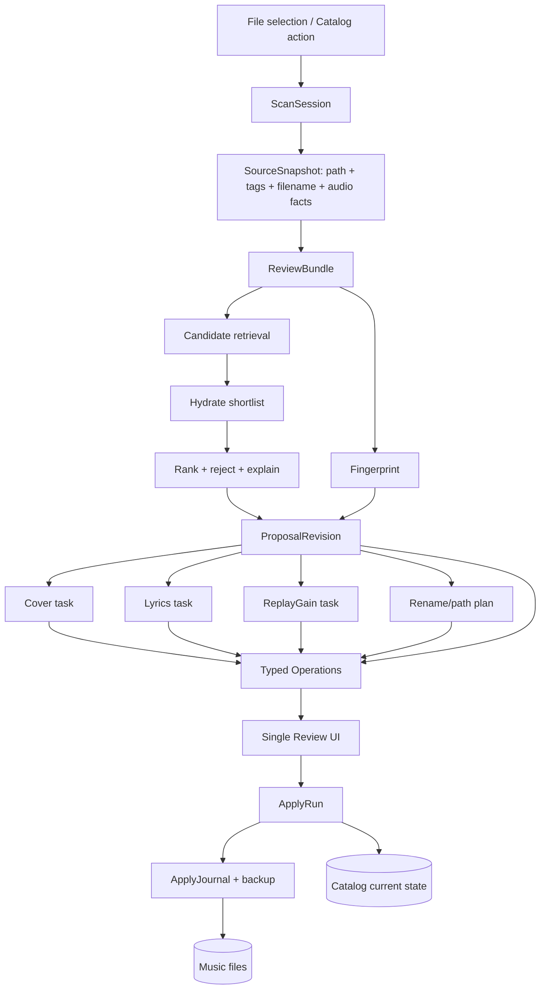

# Recovery plan

Questo piano traduce [recovery-audit.md](recovery-audit.md) in slice verticali. Non è un
programma di riscrittura totale: ogni fase deve lasciare il repository eseguibile,
misurare il comportamento e aggiornare [issues-matrix.md](issues-matrix.md).

## Outcome di prodotto

L'unità mentale primaria diventa un file o una collezione di file da sistemare, non un
job o un changeset. L'utente avvia scan/rescan, il sistema prepara una proposta completa
e la presenta in una sola review. Provider ed enrichment possono terminare in tempi
diversi; la review resta utilizzabile e spiega cosa è pronto, assente, fallito o in retry.

L'apply non sarà una transazione globale impossibile sul filesystem. Sarà:

- atomico per singolo file tramite copia temporanea, fsync e replace;
- serializzato e journaled per bundle;
- con precondition sul file letto durante la review;
- chiaramente `partially_applied` se alcuni file falliscono;
- ripetibile senza duplicare operazioni già riuscite;
- annullabile nei limiti della retention dichiarata.

## Principi

1. **Una review logica, molti task tecnici.** Unificare la UX non significa creare un
   processo monolitico.
2. **Current, proposed e attempted sono stati diversi.** Nessuna proposta modifica lo
   stato corrente prima dell'apply.
3. **Contract-first ai confini.** Provider summary, candidate hydrated, operation value e
   job result hanno tipi distinti e generano il client frontend.
4. **Fail visible, continue safely.** Fallimenti esterni non scompaiono come zero
   risultati e non bloccano sezioni indipendenti.
5. **Idempotenza persistente.** Refresh, retry, selezione candidate e apply mantengono
   identità logica attraverso restart e doppio click.
6. **Filesystem come side effect protetto.** Preview completa, hash precondition,
   journal, backup e containment restano obbligatori.
7. **Dettagli tecnici fuori dalla IA primaria.** Job, group e retention sono strumenti
   diagnostici, non il journey.
8. **Nessuna astrazione speculativa.** SQLite e worker in-process restano finché un test
   dimostra che non bastano.

## Architettura target



### Confini

- **Application services** orchestrano use case (`start_scan`, `refresh_candidates`,
  `select_candidate`, `apply_review`) e non dipendono da componenti UI.
- **Provider gateway** espone query comuni e capability, ma conserva adapter specifici.
- **Matching** riceve input immutabili e candidati idratati; non scrive DB.
- **Proposal composer** trasforma il candidate scelto e gli enrichment in typed
  operations; è l'unico posto che decide l'insieme visibile in review.
- **Apply engine** continua a essere l'unico writer dei file. ReplayGain resta analisi
  non mutante (`rsgain custom`); i valori sono tag operations normali.
- **Frontend application layer** usa API generate e view-model adapter; URL/query
  possiedono stato navigabile, TanStack Query possiede server state, Zustand solo stato
  effimero non serializzabile.

## Modello concettuale target

### `ScanSession`

Richiesta dell'utente per uno o più file/cartelle. Contiene scope, progress aggregato,
policy enrichment e relazione ai bundle. Sostituisce l'esposizione diretta di una serie
di job, senza eliminare i Job tecnici.

### `SourceItem` e `SourceSnapshot`

`SourceItem` identifica il file catalogato. Ogni nuova preparazione salva uno snapshot
immutabile di path, filename, stat/hash, metadata letti, durata e cover corrente. Questo
permette alla inbox di mostrare sempre l'origine e all'apply di rilevare modifiche
concorrenziali.

### `ReviewBundle`

Unità logica stabile per un track o una collection coerente. Ha uno stato utente:

```text
preparing → ready ↔ needs_attention → applying → applied
                  ↘ discarded       ↘ partially_applied / failed
```

Il bundle non cambia ID quando si aggiornano query o candidato. Può avere una sola
`ProposalRevision` corrente e conserva revisioni precedenti come audit compatto.

### `ProposalRevision`

Versione immutabile derivata da query, provider results, candidate scelto e policy.
Refresh crea una revisione solo se il contenuto normalizzato cambia; selezione dello
stesso candidate è idempotente. Una revisione sostituita non appare come nuova inbox row.

### `CandidateSummary` e `CandidateDetail`

- Summary: provider/type/ref, artist/title/release/year/duration, `track_count` dichiarato,
  cover thumb e disponibilità dei dettagli.
- Detail: tracklist/identificatori completi e provenance; richiesto per i candidati della
  shortlist prima del ranking finale.
- `MatchExplanation`: score totale, segnali pesati, penalità, campi mancanti, rejection
  reasons e confidence band.

### `Operation`

Union discriminata persistita e resa esplicita in OpenAPI:

```text
SetTag | WriteLyrics | EmbedArt | RemoveArt | MoveFile |
SetReplayGain | GroupingCorrection
```

Ogni operation ha current/proposed, decision, provenance, validation e apply state.
`WriteLyrics` porta sempre `{text, synced, provider}`; un editor non deve interpretare
oggetti generici.

### `TaskAttempt`

Esecuzione tecnica per retrieve/hydrate/art/lyrics/RG/fingerprint. Registra outcome per
item (`succeeded`, `not_found`, `transient_failure`, `permanent_failure`, `cancelled`),
attempt count, retry time e errore sanificato. `Job` resta l'esecutore/lease/event stream
e può essere nascosto dietro questo modello.

### `ApplyRun`

Tentativo idempotente di applicare una revisione congelata. Conserva manifest, risultato
per file e collegamento ai journal. Non confonde “nessuna operation accettata” con
`applied`.

## Decisioni maintain / fix / refactor / rewrite / remove

| Sottosistema | Decisione | Cosa si conserva | Cosa cambia |
|---|---|---|---|
| Domain field registry | Maintain | Definizioni e normalizzazione campi | Adapter verso typed operations. |
| Tag read/write | Maintain | Mutagen path e test property | Aggiungere contract per operations; nessun secondo writer. |
| File apply/backup/journal | Maintain + fix | Temp-copy, fsync, replace, containment, undo | Precondition manifest, partial outcome, reject no-op, bundle orchestration. |
| Database/Alembic | Maintain | SQLite/WAL/session/repo pattern | Schema ReviewBundle/revision/task/apply; migration one-way pre-production. |
| ChangeSet lifecycle | Replace incrementally | Change rows/applier adapter temporaneo | Nuovo modello e poi rimozione dei significati sovrapposti. |
| Job engine | Refactor | Lease, recovery, events, registry | CancellationToken, checkpoint, task result per item, system/user visibility. |
| Scan/fingerprint/group | Refactor | Scanner incrementale e fingerprint/group algorithms | Scope single-file, filename parser, cancellazione, bundle output. |
| Grouping | Keep internal + reduce | Inferenza e pinning | Nessuna pagina CRUD generale; resolver vincolato. |
| Provider HTTP/cache | Refactor | Client, cache, adapter IDs | Error taxonomy, rate/retry policy, capability/health e config resolver. |
| Matching | Rewrite behind interface | Normalizers utili, provider models/weights come baseline | Two-stage ranking, parser filename, thresholds/explanations/corpus. |
| Art/lyrics/RG | Refactor | Fetch/analyzer/processors | TaskAttempt e operations nella stessa review; selection/retry. |
| API | Refactor | FastAPI/dependencies/routers | Use-case endpoints idempotenti, schemas discriminati, Origin/CSRF admin. |
| Frontend API/state | Refactor | TanStack Query, selection store dove utile | Rimuovere tipi manuali; URL state; view-model adapter. |
| Design primitives | Maintain | Token, primitive, focus/loading/error | Aggiungere pattern data-grid, inbox, compare, status. |
| AppShell/router | Refactor | React Router | Nuova IA, scroll ownership, returnTo/prev-next/mobile drawer. |
| Changes/Review UI | Replace | Diff e thumbnail primitives, shortcut overlay | Inbox e bundle detail file-first. |
| Catalog | Refactor | Virtualization/server pagination | Grid leggibile, action detail, combined filters/rescan. |
| Groups page | Remove/merge | Nessuna route primaria | Resolver in review/import; advanced diagnostics eventuale. |
| Bulk edit | Remove progressively | Eventuali composer interni riusabili | Togliere entry UI/API dopo controllo consumer. |
| Retention | Maintain + hide | Sweep/refcount/undo expiry | System job nascosto; policy comprensibile in Settings. |
| Auth/security | Maintain + harden | Tutte le difese correnti | CSRF/Origin/re-auth reset, secret store. |
| Docker | Fix | Non-root, limits, static build | Runtime native libs, pinned base policy, capability health e CI. |
| Test tooling | Maintain + expand | Pytest/Vitest/Playwright/import-linter | Contract fixtures, Docker tests, realistic corpus, negative requirements. |

## Strategia di migrazione

Non essendoci dati di produzione, è possibile una migrazione schema distruttiva, ma non
è necessario buttare l'intera base dati ad ogni slice.

1. Aggiungere nuove tabelle accanto a ChangeSet e un adapter che traduce typed Operation
   nelle strutture accettate dall'applier corrente.
2. Far creare ReviewBundle solo al nuovo import/rescan; leggere i vecchi ChangeSet nella
   inbox tramite adapter read-only temporaneo.
3. Migrare o scartare i draft preesistenti con una migrazione esplicita. Applied/undo
   history può rimanere legacy read-only fino a scadenza.
4. Spostare una route per volta (`candidate`, enrichment, rename, apply) sul nuovo use
   case. Non fare dual-write a lungo: al massimo una release di transizione.
5. Quando gli acceptance test coprono il nuovo percorso, rimuovere builder/route/UI
   legacy e le tabelle non più necessarie in una migrazione successiva.
6. Fornire il reset libreria come percorso supportato per ambiente pre-production, ma
   non usarlo come sostituto di migrazioni ripetibili.

Per il frontend, mantenere redirect temporanei da `/changes/:id` al nuovo `/reviews/:id`
quando l'ID è traducibile. `/groups` può diventare un redirect a `/reviews?filter=grouping`
prima della rimozione definitiva.

## Piano per vertical slice

### Slice 0 — Baseline e guardrail

Outcome: CI riproduce le capability distribuite e non codifica requisiti sbagliati.

- fissare manifest dei comandi e risultati baseline di questo audit;
- aggiungere test immagine per `rsgain --version`, `fpcalc`, migrazioni, health storage;
- correggere l'E2E FTS perché richieda 200/risultato letterale;
- rendere il cancel E2E deterministico con handler reale abbastanza lungo;
- aggiungere OpenAPI generate-and-diff in CI.

Exit: bug reali diventano rossi prima della correzione; nessun refactor di dominio.

### Slice 1 — Docker e capability readiness

- installare runtime libs esplicite o copiare artefatti/libs da builder controllato;
- fallire la build se `ldd` contiene `not found` o `rsgain --version` fallisce;
- separare liveness da readiness/capabilities;
- provider/feature UI non deve dichiarare RG disponibile se probe fallisce.

Exit: `BUG-REPLAYGAIN-001` chiuso in immagine e Compose, non solo nell'host dev.

### Slice 2 — Job cancellation e provider resilience

- introdurre `CancellationToken` che rilegge DB con throttling;
- pending cancella immediatamente; running entra `cancelling` e si ferma al checkpoint;
- scan checkpoint per batch/file; import e enrichment per item; subprocess terminate con
  grace period solo quando sicuro;
- niente cancellazione durante il commit atomico di un singolo file; la richiesta viene
  rispettata prima del file successivo;
- conservare index rows già lette, marcare session/task cancelled, rimuovere temp file e
  non creare proposal per stadi non completati;
- introdurre error taxonomy/retry per HTTP e per-item result.

Exit: Cancel visibile e reale; 408 lyrics ritenta e non compromette la review.

### Slice 3 — Configurazione, secret e provider state

- `EffectiveConfigResolver` fonde file/env, setting non-secret e secret references;
- provider save effettua rebuild/swap atomico dei client oppure produce stato
  `restart_required` realmente applicato al restart; preferenza: live reload;
- spostare token in secret file montato con permessi stretti o secret store pluggable;
- startup background checks bounded e stato capability esplicito;
- Settings offre requisito auth, test connection, ultimo controllo/errore e fallback.

Exit: save→client effettivo verificato; restart preserva secret; API/log/export non lo
espongono; stati non usano `unknown` generico.

### Slice 4 — Contratti API e ReviewBundle foundation

- schema e state machine target;
- typed Operation/Pydantic discriminator e tipi frontend generati;
- unique active review per logical scope + idempotency persistente;
- SourceSnapshot e ProposalRevision;
- reject apply senza accepted operations;
- rimuovere mutazione `group.art_blob_id` allo staging.

Exit: stesso refresh/selezione non crea inbox row; lyrics editor usa testo reale; ogni
state/op è exhaustive nel frontend.

### Slice 5 — Matching v2

- parser filename separato con confidence e fallback ai tag;
- query strategy track/release per provider, inclusi ISRC e query semplificate;
- retrieval ampio ma limitato, dedup cross-provider, hydrate top-N concorrente con budget;
- scoring su artist/title/album/duration/track position/IDs, penalità esplicite e soglia
  di rifiuto; nessuna proposta automatica sotto soglia;
- explanation serializzata e corpus realistico versionato.

Exit: regressioni del brief verdi e candidato non correlato rifiutato; card mostra count
e identità corretti; provider failures separati da zero results.

### Slice 6 — Ricerca manuale e URL

- stesso gateway di Matching v2 con query editabile e provider selection;
- pagination/caching/dedup; possibilità di confrontare e aggiungere al bundle;
- registry URL allow-list: parse locale, validate type, fetch by provider ID;
- nessun networking verso host derivato liberamente dall'input.

Exit: journey E2E manual search e URL per ogni adapter supportato con fixture contract.

### Slice 7 — Proposal composer e review unificata

- candidate metadata genera tag operations;
- path plan usa i valori proposti e default `$artist - $title`;
- art/lyrics/RG diventano TaskAttempt del bundle e aggiungono operations quando pronti;
- review può essere aperta prima che enrichment opzionali finisca;
- scelta cover keep/select/remove/upload; retry per sezione;
- freeze revision prima dell'apply e warning se task ancora pending.

Exit: una sola review contiene tag, move/path, art, lyrics e RG; nessun changeset
enrichment separato visibile.

### Slice 8 — Apply bundle e catalog consistency

- generare manifest per file e verificare stat/tag hash prima della scrittura;
- applicare su temp tag+lyrics+art+RG, quindi replace e move; aggiornare DB nello stesso
  protocollo journaled;
- risultato per file e recovery idempotente; partial state esplicito;
- test apply→catalog→rescan, collisioni, failure injection e undo.

Exit: rename predefinito verificato, missing non spurio e recovery crash-safe.

### Slice 9 — Shell, Inbox e Review UX

- nuova AppShell con uno scroll owner e mobile drawer;
- nav primaria Dashboard, Catalogo, Revisioni, Attività, Impostazioni;
- inbox searchable/filterable, file source, cover, confidence, error e quick reject;
- detail file-first, candidate compare, prev/next/next-unreviewed;
- `returnTo` e URL state; J/K roving focus+scroll; toolbar non sovrapposta.

Exit: acceptance accessibility/responsive/navigation del documento UX.

### Slice 10 — Catalog, single-track e domain cleanup

- data-grid usabile, status labels e filtri combinabili;
- track detail con rescan, provider refresh, manual search e edit;
- drill-down Dashboard missing/error;
- rimuovere Groups dalla nav e arbitrary reassign; introdurre resolver grouping;
- rimuovere bulk edit UI e poi backend se senza consumer;
- spiegare duplicate evidence; nascondere system jobs.

Exit: i journey core non richiedono Groups/Jobs tecnici; singola traccia è completa.

### Slice 11 — Reset e release hardening

- reset library vs factory reset con quiesce/lock globale;
- CSRF/Origin, re-auth/frase, audit, cleanup referenziale e cache/blob;
- garantire per test che `/music` non venga cancellato o riscritto;
- full Docker E2E, restart, config persistence, backup/export e docs operative;
- eliminare adapter/schema/route legacy.

#### Threat model e failure semantics del reset

- L'operatore autenticato, un retry HTTP, un worker ancora attivo e un processo CLI
  concorrente sono tutti considerati capaci di iniziare lavoro mentre arriva un reset.
  Il reset acquisisce quindi un lock globale persistito, chiude le mutazioni HTTP già in
  corso, impedisce nuovi enqueue/apply anche fuori dal processo API, chiede la
  cancellazione cooperativa dei job e attende il quiesce prima di cancellare dati.
- Origin e token CSRF sono verificati prima della conferma. Il factory reset richiede
  inoltre la password corrente e la frase esatta documentata; password, token, path dei
  file e contenuto dei secret non entrano nell'audit. L'idempotency key è persistita con
  scope e outcome: riusarla con un altro scope fallisce, ritentare lo stesso comando non
  ripete una cancellazione già conclusa.
- Il catalog reset possiede soltanto catalogo, review, attività, cache HTTP e blob i cui
  riferimenti DB vengono rimossi nello stesso reset. Preserva Settings, provider secret,
  bootstrap config, auth epoch e audit. Il factory reset rimuove in aggiunta override DB
  e provider secret gestiti da Muzilla, poi revoca tutte le sessioni; configurazione
  bootstrap via env/file e backup musicali restano di proprietà dell'operatore.
- `storage.library_root` e `storage.backup_dir` non sono mai target. Prima della prima
  delete si rifiutano root cache/blob/secret uguali, antenate o discendenti della
  libreria, root ampie, symlink e oggetti non-directory. I test usano soltanto volumi
  temporanei, verificano hash/inode della fixture musicale e un bind read-only in
  Compose; nessun test punta a dati utente.
- Le tabelle eliminate sono allow-listed; `alembic_version`, `schema_meta`, lock e audit
  non vengono ricreati né azzerati. Le Settings sono preservate nel catalog reset e
  eliminate esplicitamente nel factory reset. Blob e cache vengono puliti soltanto dopo
  la cancellazione referenziale DB; un filesystem failure lascia un outcome persistito
  non riuscito e ritentabile, mai un successo ambiguo.
- Un crash mantiene lock, fase e scope persistiti. Lo startup, prima di client e worker,
  completa idempotentemente le sole fasi autorizzate oppure fallisce chiuso lasciando il
  lock visibile. Migrazioni e restart devono funzionare sia dopo un reset concluso sia
  durante il recovery; nessun worker parte finché il recovery non termina.

Exit: criteri globali del brief, migrazione da clean install e upgrade, security review.

Stato Slice 11: il reset e i relativi gate distruttivi sono coperti su workspace/volume
isolati; il cleanup ha rimosso router/schema Groups ormai orfani, pagina Duplicates e
route SPA tecniche. Il writer ChangeSet, le route bookmark-only e il relativo adapter
restano invece fuori da questa rimozione: `DOMAIN-CHANGES-001` conserva ancora producer,
history e undo legacy. Non sono considerati rimossi né coperti dalla Slice 11 finché non
esiste un sostituto ReviewBundle per quei consumer.

## Dipendenze critiche

```text
Docker baseline ─┬─> ReplayGain disponibile
                 └─> Docker E2E affidabile

Cancellation/provider resilience ─> pipeline unificata
Effective settings/secrets ────────> provider health/search
ReviewBundle + typed API ──────────> matching v2 ─> manual/URL search
ReviewBundle + matching ───────────> proposal composer ─> apply bundle
Stable use cases/API ──────────────> shell/inbox/review/catalog redesign
All above ─────────────────────────> reset + cleanup legacy
```

Il redesign visuale non deve anticipare il contratto ReviewBundle: farlo produrrebbe una
seconda UI costruita sul lifecycle sbagliato.

## Strategia di test

### Unit

- parser filename e normalizzazione con Unicode/punteggiatura/repeat/remix;
- scoring componenti, penalità, threshold ed explanation;
- state machine review/task/apply e operation validation;
- retry policy con clock/random deterministici;
- path rendering/sanitize/collision disambiguation;
- URL parser allow-list e secret redaction.

### Contract/integration

- fixture versionate per search summary e hydrated detail di ogni provider;
- SQLite uniqueness/idempotency/concorrenza e migrazioni;
- cancellation handler reali e partial data semantics;
- filesystem fixture per apply/undo/rescan/failure injection;
- provider 408/429/5xx/invalid credentials e cache;
- effective config e live client swap;
- Docker native binaries/libraries e capability endpoint.

### Frontend

- exhaustive rendering per review/task/provider states;
- typed editor per ogni operation;
- inbox search/filter/bulk decision;
- router returnTo/Back/prev-next;
- keyboard focus+scroll, modals, screen-reader labels, no-hover status;
- responsive visual/DOM assertions ai breakpoint minimi.

### E2E essenziali

Mantenere pochi journey completi: folder scan; automatic candidate; manual search; URL;
review completa; apply+file assertion+catalog; single-track rescan; cancel; restart Compose;
settings/secret persistence; reset con file musicali intatti. Eliminare E2E duplicati
solo dopo copertura inferiore equivalente.

Ogni bug S1/S2 richiede prima un test rosso sul confine corretto. Il numero totale di test
non è un criterio di uscita: lo sono le negative assertion (non duplica, non scrive, non
mostra operational quando non lo è).

## Strategia di sicurezza e secret

### Secret storage raccomandato

Per il deployment Docker single-user:

1. directory di configurazione persistente separata dal DB, montata read-only all'app per
   i secret già materializzati e con un piccolo percorso write controllato per Settings;
2. un file per provider o un envelope cifrato; se cifrato, master key da Docker secret o
   env/file fuori dal volume esportato;
3. permessi owner-only e scrittura atomica temp+fsync+replace;
4. nel DB solo `secret_ref`, `configured_at` e fingerprint non reversibile per change
   detection;
5. endpoint write-only: valore mai restituito, loggato, inserito in errori o export;
6. export config esclude secret per default; export con secret richiede re-auth e
   passphrase, se verrà realmente richiesto;
7. reset library preserva config/secret; factory reset li elimina esplicitamente.

Una “cifratura” con key nello stesso DB/volume non è accettata come miglioramento.

### Mutazioni sensibili

- validazione Origin e token CSRF per reset, settings secret, apply, upload e admin;
- re-auth recente/frase esatta per factory reset;
- idempotency key persistente per apply/reset/selection;
- audit con actor single-user, timestamp, scope e outcome, senza secret/path non
  necessari;
- quiesce worker prima del reset e lock che impedisce nuovi enqueue/apply.

## Criteri di completamento per slice

Ogni slice è completa solo se:

- comportamento e failure semantics sono scritti prima del codice;
- test di regressione/contratto fallisce sulla baseline e passa sulla modifica;
- lint, typing e test pertinenti passano;
- per native/deployment il test passa nell'immagine, non solo sull'host;
- API/schema generati sono aggiornati e non esistono cast compensativi nuovi;
- logging e UI distinguono assenza, temporaneo, permanente e cancellato;
- documentazione/matrice riportano file, test, rischio residuo e stato;
- nessun file dell'utente o dato fuori scope viene modificato;
- la slice è reversibile o la migrazione one-way è dichiarata e testata.

## Rischi e mitigazioni

| Rischio | Mitigazione |
|---|---|
| Dual model ChangeSet/ReviewBundle diverge | Adapter unico, niente dual-write prolungato, milestone di rimozione. |
| File cambia dopo review | SourceSnapshot + precondition; stop del singolo file e refresh review. |
| Bundle parzialmente applicato | Journal per file, outcome esplicito, retry solo failed, undo manifest. |
| Provider/rate limits allungano import | Priority queue, cache, semaphore, bounded retry, review non bloccante. |
| False confidence matching | Absolute rejection threshold, explanation, corpus e manual fallback. |
| Filename collisions con default semplice | Preview obbligatoria e suffix deterministico configurabile. |
| Reset perde secret o file | Due scope separati, DB allow-list delle tabelle, test bind mount read-only/hash. |
| Redesign rompe power-user keyboard | Shortcut contract, focus tests, progressive disclosure, no global capture in input. |
| Test mock non riflette provider | Contract fixtures dal wire format e live smoke opt-in, non E2E instabile. |

## Decisioni di prodotto risolte e ambiguità residue

Le seguenti scelte sono deducibili e non bloccanti:

- grouping resta interno; arbitrary cross-album move viene rimosso dalla UI generale;
- bulk edit viene rimosso dall'IA, salvo riuso interno temporaneo;
- default filename è `$artist - $title`, con disambiguazione in caso di collisione;
- metadata, cover e lyrics partono automaticamente; ReplayGain parte a priorità CPU
  bassa. Tutti sono configurabili e non bloccano una review utilizzabile;
- “reset library” preserva Settings/secret; “factory reset” li elimina; nessuno tocca i
  file musicali;
- apply atomico significa per-file con bundle controllato, non transazione globale.

Non ci sono domande bloccanti prima delle prime quattro slice. Prima di finalizzare la
slice cover può essere utile, ma non necessario per iniziare, decidere se supportare
anche file esterni `cover.jpg` oltre all'art embedded. La proposta di default è mostrare
lo stato del file esterno ma modificare soltanto embedded art nella prima versione, per
non introdurre una seconda policy di ownership filesystem.
