# UX redesign

La riprogettazione parte dal lavoro dell'utente, non dalle tabelle del database. Il
modello applicativo di riferimento è definito in [recovery-plan.md](recovery-plan.md): una
review logica stabile aggrega task tecnici distinti e mostra sempre il file di origine.

## Problemi da risolvere come sistema

- La navigazione espone Dashboard, Catalog, Groups, Changes, Jobs e Duplicates come
  concetti equivalenti, anche quando alcuni sono dettagli tecnici.
- Scan/import prepara solo parte del lavoro; enrichment e rename sembrano prodotti
  separati.
- La inbox non identifica con chiarezza filename/path/metadata di origine e nasconde
  l'azione primaria.
- La review è una matrice di `Change`, non una risposta alle domande “quale file?”, “quale
  risultato?”, “cosa verrà scritto?” e “cosa è incerto?”.
- Candidate card non espongono identità, tipo, track count reale, track title, durata,
  cover o motivazione del punteggio.
- Groups, force singleton e retention_sweep usano linguaggio dell'implementazione.
- Back, Close, breadcrumb, candidate selection e previous/next non condividono una
  semantica.
- Sidebar, outlet e review possiedono tutti l'altezza/scroll; footer fixed e J/K non
  seguono il viewport.
- Catalog virtualizzato è efficiente ma poco leggibile: sort nascosto, colonne rigide,
  testo troncato e status affidati a icone/hover.
- Loading/error/empty esistono come componenti, ma i provider failures vengono spesso
  ridotti a “nessun candidato”.

Il redesign non è un restyling. Mantiene token e primitive solide, ma cambia IA, journey,
contratti e gerarchia visiva.

## Utente e casi d'uso essenziali

Non servono segmentazioni artificiali: il prodotto è single-user e serve una persona che
gestisce una libreria locale. I contesti d'uso rilevanti sono:

1. **Recuperare file disordinati:** selezionare cartella/file, identificare brani anche
   con tag assenti, controllare le proposte e applicare.
2. **Correggere un elemento esistente:** dal catalogo rileggere un file, cercare un altro
   candidato, modificare manualmente o risolvere un'anomalia.
3. **Smaltire una coda:** revisionare rapidamente molti elementi affidabili, fermandosi
   solo sulle differenze rilevanti.
4. **Diagnosticare:** capire perché un provider, un file, ReplayGain o un apply non ha
   funzionato e ritentare senza ripartire da zero.
5. **Amministrare:** configurare provider/secret/policy, controllare capacità e fare reset
   sicuro senza toccare la musica.

## Principi UX

1. **File first.** Filename, path e stato fisico sono sempre visibili nella inbox e nel
   detail.
2. **Outcome over machinery.** “Preparazione lyrics” e “Analisi volume” sostituiscono
   nomi di job; gli ID tecnici restano nel pannello diagnostico.
3. **Una decisione informata.** La review mostra prima cambi ad alto impatto/incerti;
   dettagli ripetitivi sono espandibili.
4. **Progressive readiness.** Si può aprire una review mentre enrichment opzionali sono
   in corso. Ogni sezione ha stato autonomo e retry.
5. **No silent fallback.** Zero risultati, provider fallito, non configurato e rate
   limited sono messaggi distinti.
6. **Safe by default.** Apply, remove art, bulk reject e reset comunicano scope e
   reversibilità. Nessuna azione distruttiva dipende solo da colore/icona.
7. **Navigation is state.** Filtri, sort, item corrente e origine sono URL/state
   ripristinabili; Close e Back non creano draft intermedi.
8. **Keyboard and pointer parity.** Ogni azione core ha focus visibile e percorso senza
   hover. Le shortcut non intercettano input o modali.

## Information architecture target

### Navigazione primaria

1. **Dashboard** — salute e prossimo lavoro, tutti i contatori sono drill-down.
2. **Catalogo** — file conosciuti, ricerca, dettaglio e azioni sul singolo file.
3. **Revisioni** — inbox di ReviewBundle pronti/in preparazione/con problemi.
4. **Attività** — sessioni di scan/apply visibili; diagnostica job solo espandibile.
5. **Impostazioni** — libreria, provider, filename/enrichment, storage e amministrazione.

La sidebar contiene questi cinque item. “Sign out” resta in un footer stabile della
sidebar; su mobile è nel drawer, non nel content flow.

### Destinazioni secondarie

- **Duplicati** diventa un filtro/strumento del Catalogo (“Possibili duplicati”), con
  evidence esplicita.
- **Groups** non è più una destinazione primaria. Gli elementi con grouping incerto
  appaiono in Revisioni con azione “Risolvi raccolta”.
- **Jobs** non è più una lista indiscriminata. Attività aggrega le sessioni utente e offre
  “Dettagli tecnici” con JobEvent. I system job sono nascosti per default.
- **Bulk edit**, find/replace e strip vengono rimossi dalla nav e dalle azioni principali.
- **Retention** è una policy “Cronologia annullamento” in Impostazioni.

### Route indicative

```text
/                         Dashboard
/catalog                  Catalogo
/catalog/:trackId         Dettaglio file
/reviews                  Inbox revisioni
/reviews/:reviewId        Review detail
/activity                 Sessioni e apply
/settings                 Impostazioni
/settings/providers/:id   Diagnostica provider (dialog/route responsive)
```

Filtri e sort sono query parameter. Una route legacy può redirigere senza aggiungere
history artificiale.

## Journey principale: scan → candidate → review → apply

```mermaid
flowchart LR
    A[Seleziona file/cartella] --> B[Conferma scope e policy]
    B --> C[Scan rapido locale]
    C --> D[Review create]
    D --> E[Candidate automatici]
    E --> F{Confidenza}
    F -->|alta| G[Preseleziona e prepara]
    F -->|bassa/nessuno| H[Ricerca manuale o URL]
    H --> G
    G --> I[Art / lyrics / ReplayGain in parallelo]
    I --> J[Review unica]
    J --> K[Accetta / modifica / rifiuta]
    K --> L[Preview finale + Apply]
    L --> M[Esito per file + Catalogo aggiornato]
```



### 1. Selezione

L'utente seleziona directory o file entro la library root. La schermata mostra:

- scope risolto e conteggio stimato;
- inclusioni/esclusioni e file non supportati;
- policy attive: candidate automatici, cover, lyrics, ReplayGain, rename;
- costo indicativo: rete per file/release e ReplayGain “può richiedere tempo”;
- Start, non un wizard multi-step se non ci sono decisioni necessarie.

Se il prodotto web non può aprire un native file picker sul filesystem server, la UI deve
dirlo: seleziona percorsi già montati sotto la library root, con browser server-side
contenuto e containment, non fingere un upload.

### 2. Preparazione

Dopo Start si va ad Attività o direttamente a una vista di sessione. Il progress è per
outcome (“143/200 file letti”, “36 review pronte”), non solo una percentuale. Cancel
diventa “Annullamento…” subito e spiega: file già indicizzati restano nel catalogo, review
non completate non vengono create, nessun file musicale viene modificato dallo scan.

Le review pronte sono apribili senza attendere cover/lyrics/RG di tutti gli elementi.

### 3. Candidato automatico

Il sistema preseleziona solo sopra una soglia sicura. Sotto soglia, la review è
`Richiede attenzione`; non viene promossa una corrispondenza semplicemente perché è la
migliore di una lista scarsa. La riga inbox mostra score band e motivo principale:
“Titolo e artista corrispondono; durata differisce di 2 s” oppure “Solo album simile”.

### 4. Review

La revisione presenta un confronto aggregato e permette decisioni per sezione/campo.
La selezione candidate aggiorna una revisione dello stesso item, non crea una riga nuova
né una nuova history entry.

### 5. Apply

Il footer/sticky action area mostra sempre:

- numero file e operazioni accettate;
- rename/path finale e collision warnings;
- enrichment ancora pending/falliti;
- disponibilità e scadenza stimata dell'undo;
- `Applica N modifiche` come azione primaria e `Salva per dopo` implicito via autosave.

La conferma finale è proporzionata: non chiede di rileggere ogni campo, ma evidenzia
move, remove art, overwrite e file cambiati dal momento dello scan. Se zero operazioni
sono accettate, Apply è disabilitato e l'azione disponibile è `Archivia senza modifiche`.

## Flusso singola traccia

Il dettaglio Catalogo separa quattro azioni che oggi si confondono:

- **Rileggi file:** verifica existence/stat, rilegge tag/cover e aggiorna lo snapshot del
  catalogo; non contatta provider.
- **Cerca corrispondenze:** rigenera query e candidati, usando snapshot aggiornato;
  aggiorna/crea una sola review attiva.
- **Modifica manualmente:** apre una review con operation create dall'utente; non scrive
  subito il file.
- **Analizza di nuovo:** rilettura + fingerprint/RG opzionale + matching secondo policy.

La riga Catalogo espone un menu, mentre click su titolo apre il dettaglio, non salta
direttamente in un editor. “Risolvi” può essere la CTA inline quando lo stato richiede
attenzione.

Se il file manca, il dettaglio mostra ultimo path, data ultimo avvistamento, ultima
modifica nota e azioni `Verifica di nuovo`, `Localizza` (solo entro root, se implementato)
o `Rimuovi dal catalogo`. Il contatore Dashboard porta a questo filtro.

## Ricerca manuale

La ricerca manuale è un drawer desktop/pagina mobile dentro la review, non un prodotto
separato.

Campi inizializzati da tag+filename:

- titolo e artista;
- album/release;
- anno, durata, ISRC facoltativi;
- provider checkbox con stato accanto al nome.

Il submit mostra risultati progressivamente per provider. Ogni sezione può dire
`3 risultati`, `nessun risultato`, `non configurato`, `temporaneamente non disponibile`
o `credenziali non valide`. Filtri tipo track/release e anno sono secondari. Infinite
scroll non è necessario: paginazione `Mostra altri` rende rate/costo espliciti.

I duplicati cross-provider sono raggruppati quando identificatori o segnali forti lo
consentono, ma provenance e varianti restano accessibili. Selezionare non applica:
aggiunge il candidate alla review e avvia hydrate/enrichment.

## Candidato da URL

`Aggiungi da URL` è nello stesso drawer. La UI elenca esempi di domini/tipi supportati
per provider e valida localmente la forma, poi il backend riconosce allow-list e ID.

Stati:

1. URL riconosciuto: mostra provider e tipo prima del fetch;
2. tipo non supportato: messaggio specifico (“playlist Deezer non supportata; usa album o
   track”);
3. item non trovato/non accessibile: distinguere 404, auth e temporaneo;
4. candidato già presente: seleziona/evidenzia l'esistente, non duplica;
5. candidato valido: hydrate, confronto e `Usa questo risultato`.

La UI non deve suggerire che qualunque URL verrà scaricato e non deve mostrare secret o
URL di richieste interne.

## Enrichment nella review

### Cover art

La sezione mostra affiancati:

- cover corrente (`Embedded`, eventuale file esterno solo informativo);
- candidate ordinate con thumbnail, provider, dimensioni e formato;
- placeholder esplicito se non disponibile;
- scelte `Mantieni`, `Usa`, `Rimuovi`; `Carica immagine` se la slice sicura è abilitata.

Il click apre preview grande senza perdere la decisione. Una cover già in cache non deve
causare layout shift; dimensione visuale riservata. Alt text descrive origine/stato, non
ripete inutilmente “image”.

### Lyrics

La sezione mostra sorgente, synced/plain, testo con preview e `Modifica`. L'editor è una
textarea inizializzata con `value.text` e preserva lo stato synced solo se le timestamp
restano valide; una modifica libera di lyrics sincronizzate propone di convertirle in
plain oppure valida il formato, mai silenziosamente.

Stati `Non trovate` e `Provider temporaneamente non disponibile` sono distinti. Il
secondo offre Retry; il primo offre ricerca/manual paste, se supportato. Un 408 non chiude
o invalida il resto della review.

### ReplayGain

Mostra `Analisi volume` con track gain/peak e album gain se disponibile. Non serve una
decisione per ogni numero: toggle di sezione accetta/rifiuta il set coerente, con detail
espandibile. Stato `Non disponibile in questa installazione` include istruzione
diagnostica; non esiste un pulsante destinato a fallire.

### Fallimenti parziali

Ogni sezione usa lo stesso pattern:

```text
In attesa · In corso · Pronto · Non trovato · Da configurare ·
Temporaneamente fallito · Fallito permanentemente · Annullato
```

`Riprova` agisce sulla sezione/item, non ricrea la review. Un banner aggregato appare
solo se il problema cambia la possibilità di apply.

## Inbox revisioni

### Struttura desktop

```text
┌ Revisioni ─────────────────────────────────────────────────────────────┐
│ Cerca file, path, artista, titolo…   [Stato] [Confidenza] [Provider]  │
│ [12 da rivedere] [4 con errori] [31 pronte]       Sort: Priorità      │
├────┬──────────────────────────────┬────────────┬──────────┬────────────┤
│ art│ 01_headhunterz_oxygen.flac   │ Headhunterz│ Attenzione│ 2 errori  │
│    │ /incoming/… · scanned 10:42 │ Oxygen     │ 72%      │ [Apri →]  │
├────┼──────────────────────────────┼────────────┼──────────┼────────────┤
│ art│ Piki - Twilight Twilight.mp3 │ Piki       │ Pronta   │ CAA pending│
│    │ /singles/…                  │ Twilight…  │ 94%      │ [Apri →]  │
└────┴──────────────────────────────┴────────────┴──────────┴────────────┘
```

L'intera riga è apribile, ma link/checkbox/quick action restano target distinti. Filename
è il titolo primario; artista/titolo proposti sono secondari. Path ha copy action e
middle-ellipsis solo se esiste anche un modo visibile per leggerlo interamente.

### Ricerca e filtri

Ricerca libera su filename, path, metadata originali/proposti, provider, errore e ID.
Filtri combinabili diventano chip rimovibili e vivono nella query URL. Set minimo:

- stato: Preparing, Ready, Needs attention, Failed, Applied/Archived;
- confidence band;
- issue: missing file/provider/enrichment/collision;
- source/session/provider;
- data scan.

Default ordina: errore bloccante, bassa confidenza, più vecchio. Applied/Archived sono
nascosti ma raggiungibili.

### Azioni rapide

- `Apri`/click riga;
- `Accetta proposta` solo per high-confidence e dopo preview summary;
- `Rifiuta proposta` archivia la review senza scrivere file ed è reversibile;
- selezione multipla consente rifiuto/archiviazione su item selezionati, non su un filtro
  invisibile. Mostra conteggio e permette Undo toast.

La riga può espandere un summary dei cambi, ma non replica l'intera review. Su mobile non
si usa una tabella compressa: card/list row con le stesse informazioni.

## Review detail

### Gerarchia

```text
Top bar:  ← Revisioni     17 di 46     [Precedente] [Successiva non rivista]

Source header
  cover · filename originale · path · formato/durata · stato fisico
  metadata originali

Candidate
  candidato selezionato + confidence/explanation    [Cambia / Cerca]

Proposed changes
  Metadata tags     6 cambi · 1 incerto
  File name/path    preview + collision status
  Cover             current → selected
  Lyrics            ready / error + retry
  Volume            analyzing / proposed values

Sticky action area
  9 accepted · 1 rejected · 1 pending      [Archivia] [Applica]
```

Desktop può usare due colonne soltanto quando il viewport lo permette: contenuto review
principale e candidate drawer/panel. La colonna candidate non deve comprimere i diff.
Tablet/mobile usa una sola colonna e candidate come full-screen dialog/route.

### Candidate card

Gerarchia compatta:

1. artista — titolo traccia o release;
2. album/release, anno e tipo;
3. durata, track position e count dichiarato;
4. provider badge e confidence;
5. una riga “Perché” (`title exact · artist exact · duration +2s`) e detail espandibile;
6. thumbnail solo se disponibile, placeholder stabile altrimenti.

Risultati con stessa release ma track diverse devono differire già alla prima riga. Le
card duplicate cross-provider si raggruppano visualmente ma mantengono fonti selezionabili.

### Diff e decisioni

- mostra current e proposed con label umane, non JSON;
- campi invariati sono collassati in “N invariati”;
- sezioni/campi incerti sono aperti per default;
- accept/reject di sezione non sovrascrive edit manuali senza conferma;
- `Rifiuta tutti i tag` agisce sulla sezione Metadata, non su rename/art/lyrics/RG;
- ogni valore editabile usa componente tipizzato (testo, multi-value, data, art, lyrics,
  numeric RG), validazione inline e undo edit;
- provenance è disponibile, ma non compete con il valore principale.

## Dashboard

La Dashboard è orientata a prossimo passo:

- `Revisioni da completare`, `Problemi da risolvere`, `File mancanti`, `Provider da
  configurare` sono card-link con filtro target;
- recente attività mostra sessione/outcome, non raw job type;
- provider health usa label complete e `last checked`, con CTA appropriata;
- capability native (ReplayGain/fingerprint) appare solo se degradata o nella diagnostica;
- nessun contatore privo di elenco corrispondente.

## Catalogo

La tabella resta il pattern desktop corretto per una libreria ampia se diventa un vero
data-grid:

- sorting dagli header con direzione e stato accessibile;
- colonne ridimensionabili con min/max e reset; preferenze locali opzionali;
- overflow orizzontale controllato, prima colonna identity sticky solo se non oscura;
- title/artist leggibili; wrap 2 righe o dettaglio inline, non tooltip-only;
- colonna Stato testuale (`Missing art`, `No lyrics`, `Needs review`, `Missing file`);
- ricerca libera come default; filtri combinabili ricercabili, non dropdown da 500 item;
- click titolo apre dettaglio; selection resta solo per azioni realmente mantenute;
- mobile usa list cards, non colonne microscopiche.

Il missing deve essere includibile con filtro, pur rimanendo escluso dalle normali azioni
che richiedono file presente.

## Impostazioni e provider

Ogni scheda provider mostra:

- scopo (`Metadata`, `Cover`, `Lyrics`, `Fingerprint`);
- credenziali: non richieste/opzionali/richieste;
- enabled e token configured senza mai restituire il token;
- stato: Disabled, Not configured, Checking, Operational, Temporarily unavailable,
  Invalid credentials;
- ultimo check e messaggio sanificato;
- `Test connection`, `Save`, `Clear credential` con conferma;
- effetto di assenza/failure sul workflow.

Filename/enrichment include preview `$artist - $title`, collision policy e toggle default.
Storage mostra library/data/cache location in sola lettura quando bootstrap-only.

Area pericolosa:

- `Reset catalogo e attività` preserva configurazione/secret e non tocca `/music`;
- `Ripristino di fabbrica` elimina anche config/secret;
- dialog elenca esattamente tabelle/cache/blob interessati, richiede re-auth/frase e
  mostra worker quiescing/result. Non usare un confirm browser nativo.

## Attività e diagnostica

La lista primaria raggruppa per azione utente: `Scansione cartella`, `Applicazione 12
file`, `Analisi duplicati`. Mostra progress/outcome e Cancel solo se la fase lo supporta.
Durante richiesta di cancel: bottone disabilitato, stato `Annullamento…`, testo sulla
fase non interrompibile corrente.

Il detail tecnico espande task/job/event, attempt e correlation ID. `retention_sweep`
appare soltanto con filtro “Mostra attività di sistema” e label “Pulizia cronologia di
annullamento”.

## Schermate: mantenere, modificare, unire, eliminare

| Attuale | Decisione | Target |
|---|---|---|
| Dashboard | Modificare | Dashboard drill-down e next work. |
| Catalog | Modificare | Data-grid + track detail/actions. |
| TagEditor | Unire | Typed manual operations dentro Review detail. |
| RenameTracks | Unire | File/path section della stessa review. |
| Import / ImportReview | Modificare/unire | ScanSession progress e link alle ReviewBundle. |
| ChangesList | Sostituire | Inbox Revisioni. |
| ChangeSetReview | Sostituire gradualmente | ReviewBundle detail, riuso diff/thumbnail primitive. |
| Jobs | Modificare | Attività aggregate + diagnostica. |
| Duplicates | Unire | Catalog filter/tool con evidence. |
| Groups / GroupDetail | Eliminare dalla IA | Resolver collection nelle review a bassa confidenza. |
| Settings | Modificare | Provider/effective config/secret/policy/reset. |
| ComponentGallery | Mantenere dev-only | Documentazione/test del design system, mai nav production. |

## Pattern condivisi

### Status

Ogni status usa label + eventuale icona + descrizione, non colore o hover soli. Lessico
unico per provider, task e review; tone visuale (`neutral/info/warning/danger/success`) non
sostituisce lo stato di dominio.

### Feedback

- optimistic solo per decisioni reversibili/autosave;
- mutazioni file/reset mostrano progress reale e result persistente;
- toast conferma azioni piccole e offre Undo, ma errori/blocchi restano inline;
- error banner non cancella dati già caricati;
- retry conserva query, selezione e posizione.

### Loading

- skeleton con dimensione stabile per lista/thumbnail;
- progress determinato quando esiste total, altrimenti testo della fase;
- candidate provider arrivano progressivamente senza riordinare la selezione sotto il
  cursore; nuovi risultati si annunciano e si inseriscono dopo conferma o con posizione
  stabile.

### Empty

Distinguere:

- zero dati iniziali → CTA scan;
- zero risultati del filtro → Clear filters;
- provider zero hit → modifica query/altro provider/URL;
- provider non interrogato/fallito → configure/retry;
- tutto revisionato → outcome positivo e link Archived.

### Error

Messaggio in linguaggio utente, provider/file/item identificabile, errore tecnico
espandibile/copyable senza secret. Indicare se è sicuro ritentare e cosa è rimasto
invariato.

### Conferme

Usare conferma forte solo per apply con rischio rilevato, bulk reject ampio, clear secret
e reset. Non chiedere conferma per selezionare un candidate o cambiare filtro.

## Design system

Conservare token e primitive attuali, aggiungendo componenti guidati dai nuovi pattern:

- `AppFrame`, `Sidebar/Drawer`, `PageHeader`, `ContextNav`;
- `StatusBadge` con label obbligatoria;
- `ReviewRow`, `SourceIdentity`, `CandidateCard`, `MatchExplanation`;
- `OperationSection` e editor tipizzati;
- `DataGrid` con header sort/resize e `MobileRecordList`;
- `TaskState`, `InlineError`, `DiagnosticDetails`;
- `StickyActionBar` che riserva layout space;
- `DangerZoneAction` con re-auth/phrase contract.

Regole visuali:

- una sola azione primaria per regione;
- spaziatura/densità coerenti, non più informazioni perché disponibili;
- testo leggibile almeno fino a zoom 200%;
- cover e status con dimensioni riservate per evitare layout shift;
- focus ring non rimosso; contrasto WCAG AA;
- motion breve e disabilitabile via `prefers-reduced-motion`.

## Responsive

### Desktop ≥ 1200 px

Sidebar stabile, outlet scrollabile, inbox data-grid, review 1–2 colonne. Candidate panel
ha larghezza minima e può diventare drawer se il diff non resta leggibile.

### Tablet 768–1199 px

Sidebar collapsible, data-grid con colonne prioritarie e overflow esplicito, review singola
colonna; action bar sticky nel content container.

### Mobile < 768 px

Drawer nav, list card al posto delle tabelle, candidate/search come route/dialog full
screen, action bar sopra safe-area. Non mostrare una shortcut bar da tastiera permanente
su touch; mantenerla disponibile da Help quando tastiera è rilevata.

Testare anche viewport basso, landscape, safe-area, testo lungo, font scaling e zoom;
non soltanto tre larghezze nominali.

## Accessibilità

- landmark `nav/main/aside`, heading order e skip link;
- focus restituito al trigger alla chiusura dei dialog;
- error summary per form e associazione label/description/error;
- aria-live polite per nuovi risultati/progress, assertive solo per errori bloccanti;
- virtualized rows conservano focus/announcement e non rendono irraggiungibili item;
- status mai solo colore/icona; cover selection ha nome e stato testuali;
- hit target ≥ 44 px sui controlli touch;
- tooltips sono supplementari;
- non assegnare shortcut single-key mentre il focus è in input, textarea, select,
  contenteditable o dialog che le disabilita;
- test automatici axe dove utile più test tastiera manuali/E2E.

## Scorciatoie

Contratto review/inbox proposto:

| Tasto | Azione | Note |
|---|---|---|
| `j` / `k` | Riga/sezione successiva o precedente | Muove focus e `scrollIntoView({block: "nearest"})`. |
| `Enter` | Apri/toggle dettaglio | Apply non parte mai direttamente. |
| `a` | Accetta item/sezione | Disabilitato in editor/modal. |
| `r` | Rifiuta item/sezione | Reversibile; non è reject-all filtro. |
| `e` | Modifica valore focalizzato | Solo operation editabile. |
| `[` / `]` | Review precedente/successiva | Mantiene ordine filtrato. |
| `Shift+]` | Successiva non revisionata | Annuncio posizione. |
| `Esc` | Chiude layer corrente | Non scarta implicitamente. |
| `?` | Help scorciatoie | Elenco contestuale, non globale indistinto. |

La toolbar shortcut è sticky dentro il layout e il suo spazio è calcolato; può essere
ridotta/nascosta. J/K usa roving tabindex e la virtualizzazione deve materializzare la
riga target prima di spostare focus.

## Browser Back, Close e stato

Regole normative:

- **Back del browser** torna all'entry precedente reale. La scelta di un candidate
  aggiorna la review con `replace`/mutation, non aggiunge un'altra review alla history.
- **Close** usa `returnTo` validato come route interna. Se assente, torna a `/reviews`
  con i query parameter memorizzati; non usa un back cieco che potrebbe uscire dall'app.
- **Breadcrumb** mostra l'origine (`Catalogo / File / Review` oppure `Revisioni / …`), non
  è hard-coded.
- **Prev/Next** cambia item nell'ordine filtrato senza perdere query e scroll; può usare
  replace per una sequenza di triage, mentre un'apertura esplicita di nuova riga usa push.
- **Autosave** conserva decisioni/edit validi. Non esiste un ambiguo “Cancel” della
  pagina; `Archivia senza modifiche` e `Ripristina proposta` sono azioni esplicite.
- **Discard** richiede conferma solo se elimina edit manuali non ricostruibili; refresh
  candidate crea revision, non una nuova inbox row.
- **Scroll** della inbox è ripristinato tramite item anchor, non coordinate fragili, dopo
  Close/Back.

## Criteri di accettazione UX

- Un utente può identificare file origine e path da inbox e review senza hover.
- In massimo due azioni dal Catalogo può rileggere, cercare candidati o aprire una review.
- Candidate omonimi sono distinguibili senza aprirli.
- Zero risultati non è confuso con provider fallito/non configurato.
- Tag, filename/path, cover, lyrics e RG sono visibili nella stessa review.
- Tutte le decisioni hanno preview dell'effetto sul file; zero accepted non applica.
- Previous/next/next-unreviewed e Back preservano filtro/posizione.
- J/K muovono focus e viewport; nessuna toolbar copre contenuto.
- Sidebar/sign-out restano raggiungibili a viewport corto e zoom 200%.
- Catalog è utilizzabile con tastiera, testo lungo, mobile e status testuali.
- Group e retention non sono necessari per completare il journey principale.
- Missing/provider/apply errors sono drill-down e offrono una prossima azione.
- Reset dichiara e verifica che i file musicali restino intatti.
